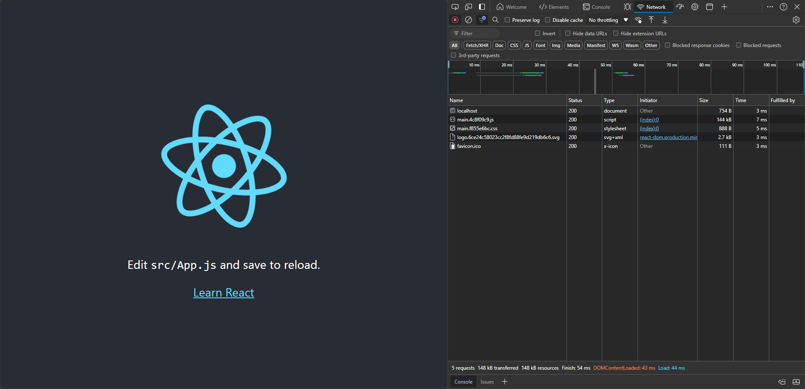
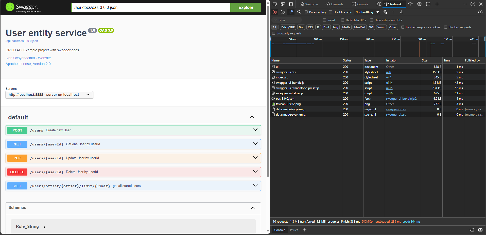

# 🛠️ Oatpp (Oat++) Example-CRUD with React

---

## 🖼️ Screenshots

Take a look at some visuals from the application:

<p align="center">
  
  
</p>

---

## 📝 Information

### 🛠️ Building and Running the App on Windows

To build and use this application on Windows, follow these steps:

1. **Install MSYS2**: Download and install MSYS2 from the official website.
   - [MSYS2 Installation Guide](https://www.msys2.org/)

2. **Update Packages**: Open **MSYS2 MSYS** and run the following commands to update your packages:
   pacman -Syu

   - **Note**: The terminal will close after the first update. Reopen **MSYS2 MSYS** and continue with:
   pacman -Su
   pacman -Sy

3. **Install Required Packages**: Open **MSYS2 MinGW x64** and install the necessary packages:
   pacman -S mingw-w64-x86_64-gcc
   pacman -S mingw-w64-x86_64-gdb
   pacman -S mingw-w64-x86_64-make
   pacman -S mingw-w64-x86_64-cmake

4. **Set Path**: Add `C:\msys64\mingw64\bin` to your system PATH (Environment Variables in Windows).

5. **Run the Script**: Execute the PowerShell script located in the `utility` folder.

6. **Done**: The application should now be ready to use!

---

## 🌟 About This Project

This project provides a complete example of a "CRUD" service (UserService) built with Oat++. It demonstrates:

- How to create CRUD endpoints.
- How to use [Oatpp ORM](https://oatpp.io/docs/components/orm/#high-level-overview) with an SQLite example.
- How to document APIs with Swagger-UI and OpenApi 3.0.0.

Learn more about Oat++:

- [Oat++ Website](https://oatpp.io/)
- [Oat++ GitHub Repository](https://github.com/oatpp/oatpp)
- [Get Started](https://oatpp.io/docs/start)

---

## 🗂️ Project Layout

Here’s a quick overview of the project structure:
```
|- CMakeLists.txt                        // Project's CMakeLists.txt
|- sql/                                  // SQL migration scripts for SQLite database
|- src/
|   |- controller/                       // REST Controllers (UserController)
|   |- db/                               // Database client
|   |- dto/                              // Data Transfer Objects (DTOs)
|   |- service/                          // Business logic classes (UserService)
|   |- AppComponent.hpp                  // Service configuration
|   |- DatabaseComponent.hpp             // Database configuration
|   |- SwaggerComponent.hpp              // Swagger-UI configuration
|   |- App.cpp                           // Main application entry point (main())
|- test/                                 // Tests folder
|- utility/install-oatpp-modules.sh      // Utility script to install required Oatpp modules
```


## ⚙️ Build and Run

### 🔨 Using CMake

#### Pre-requirements

Ensure that the following Oatpp modules are installed:

- `oatpp`
- `oatpp-swagger`
- `oatpp-sqlite` (with `-DOATPP_SQLITE_AMALGAMATION=ON` CMake flag).

**Note:** You can run the `utility/install-oatpp-modules.sh` script to install the required Oatpp modules.

#### Building the Project

   mkdir build && cd build
   cmake ..
   make
   ./crud-exe  # Run the application

### 🐳 Using Docker

You can also build and run the application using Docker:

   docker build -t example-crud .
   docker run -p 8000:8000 -t example-crud

---

## 📋 API Endpoints

### 🌐 HTML

| HTTP Method | URL                                   | Description      |
|-------------|---------------------------------------|------------------|
| `GET`       | `http://localhost:8000/`              | Root page        |
| `GET`       | `http://localhost:8000/swagger/ui`    | Swagger UI page  |

### 👤 User Service

| HTTP Method | URL                                                       | Description           |
|-------------|-----------------------------------------------------------|-----------------------|
| `POST`      | `http://localhost:8000/users`                              | Create new User       |
| `PUT`       | `http://localhost:8000/users/{userId}`                     | Update User by ID     |
| `GET`       | `http://localhost:8000/users/{userId}`                     | Get User by ID        |
| `DELETE`    | `http://localhost:8000/users/{userId}`                     | Delete User by ID     |
| `GET`       | `http://localhost:8000/users/offset/{offset}/limit/{limit}` | Get All Users with Paging |

---
